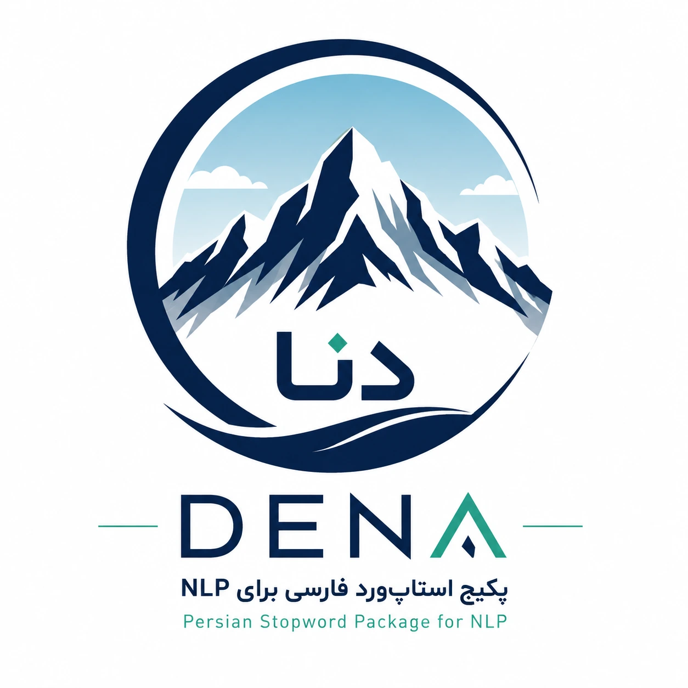
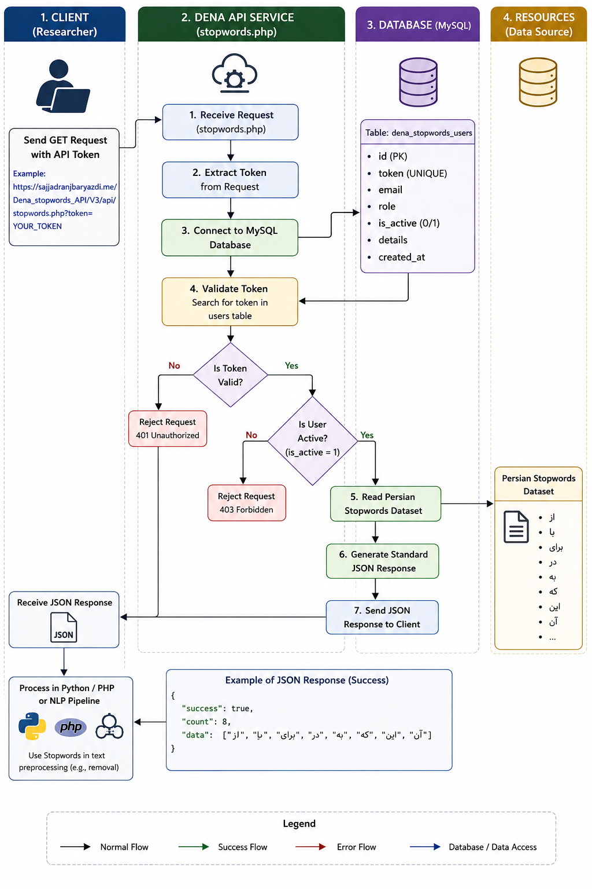

Last Updated: August 18, 2026

## DENA – Persian Stopword API for Natural Language Processing

Empowering researchers and developers with a standard, accessible Persian stopword resource.




## Table of Contents

- [Introduction](#introduction)
- [What is a Stopword?](#what-is-a-stopword)
- [Why is Removing Stopwords Important?](#why-is-removing-stopwords-important)
- [Should Stopwords Always Be Removed?](#should-stopwords-always-be-removed)
- [Challenges of Stopwords in Persian](#challenges-of-stopwords-in-persian)
- [What is DENA?](#what-is-dena)
- [DENA Architecture](#dena-architecture)
- [DENA User Authentication](#dena-user-authentication)
- [API Output](#api-output)
- [Using DENA in Python](#using-dena-in-python)
- [Using DENA in an NLP Project with Python](#using-dena-in-an-nlp-project-with-python)
- [Using DENA with TF-IDF](#using-dena-with-tf-idf)
- [Using DENA in PHP](#using-dena-in-php)
- [Token Management & Security](#token-management--security)
- [Use in Research Projects & Integration](#use-in-research-projects--integration)
- [Frequently Asked Questions](#frequently-asked-questions)
- [Final Conclusion](#final-conclusion)


DENA – Persian Stopword API for Natural Language Processing

## Start Now

The Dena Stopword API is published for free and is available for all researchers.

[**Get your token**](https://sajjadranjbaryazdi.me/blogs/get_dena_token.php)

> *Dear Science Friend, I am proud to provide the Persian stopword package DENA for natural language processing in artificial intelligence for free to dear researchers. In order to learn more about this package, I invite you to read the following blog.*
>
> *Best regards, Sajjad Ranjbar.*
>
> #### Sajjad Ranjbar
>
> Project Lead

## Introduction

Natural Language Processing (NLP) is one of the most important branches of artificial intelligence, developed with the goal of processing, analyzing, and extracting information from textual data. Today, an enormous volume of information exists on social media, websites, scientific articles, organizational systems, chats, user comments, and various documents, all stored as text.

However, raw text is generally not directly usable by machine learning algorithms and NLP models. Before textual data enters a model, a series of preprocessing operations are typically performed, including normalization, noise removal, tokenization, lemmatization, stemming, and stopword removal.

One of the important steps in this process is removing stopwords.

Stopwords are words that typically have a limited role in identifying the topic or main meaning of a text, and in many NLP applications, their removal can be considered a step toward noise reduction and data dimensionality reduction.

In the Persian language, this issue becomes even more significant because of linguistic structure, writing variations, the use of zero-width non-joiners (ZWJ), different written forms of words, and the lack of a single comprehensive list of stopwords. As a result, researchers in many projects are forced to manually create their own stopword lists or collect them from various sources.

To solve this problem, **DENA** has been designed—a package and API service that provides a Persian stopword list for use by researchers, students, developers, and natural language processing projects.

## What is a Stopword?

In natural language processing, a stopword is a word or token that has relatively low informational value for the intended analysis in a specific application and can be removed before the modeling stage.

For example, in a Persian text, words such as: *از (from), به (to), در (in), با (with), و (and), که (that/which), را (direct object marker), این (this), آن (that)* carry much less semantic weight than words that define the main topic of the text.

Suppose we have the following text: *"این مقاله درباره کاربرد یادگیری ماشین در تشخیص بیماری‌های مختلف است."* (This article is about the application of machine learning in diagnosing various diseases.) After tokenization, tokens such as *این (this), مقاله (article), درباره (about), کاربرد (application), یادگیری (learning), ماشین (machine), در (in), تشخیص (diagnosis), بیماری‌های (diseases), مختلف (various), است (is)* may be generated. If the system's goal is to extract keywords or create a statistical representation of the text, some of these words may have lower informational value. Therefore, by using an appropriate stopword list, a portion of these words can be removed.

## Why is Removing Stopwords Important?

Removing stopwords is not merely a simple step in text preprocessing; in many NLP projects, it can affect data volume, processing speed, and the quality of textual representation.

#### 1. Data Volume Reduction

One of the most important advantages of removing stopwords is reducing the number of tokens that must be processed by the algorithm. Suppose a dataset contains several million sentences. If a significant number of tokens in these sentences consist of high-frequency, low-information words, removing them can reduce the number of tokens that need to be processed. This is particularly important in large-scale NLP projects.

#### 2. Feature Dimensionality Reduction

In methods such as Bag of Words, TF-IDF, Count Vectorization, and some feature engineering approaches, each word can become a feature. The presence of many low-information words can increase the dimensionality of the feature space. For example, if a model is built with 100,000 features, some of these features may correspond to very frequent words that provide little information about the class or topic of the text. Removing stopwords can help mitigate this problem in certain applications.

#### 3. Noise Reduction

Stopwords do not provide much discriminative information in many text classification applications. For example, in a system for categorizing scientific articles, words such as *"از" (from), "به" (to), "در" (in), and "که" (that/which)* typically provide limited information about the article's topic. In contrast, words like *یادگیری ماشین (machine learning), رمزنگاری (cryptography), شبکه عصبی (neural network), پردازش زبان طبیعی (natural language processing)* can provide much more information about the text's subject.

## Should Stopwords Always Be Removed?

**No.** This is one of the most important points that should be considered when designing NLP pipelines. Stopword removal is not a universal or mandatory rule for all NLP projects. In some applications, removing stopwords can cause the loss of important information from the text. For example, in systems for sentiment analysis, negation detection, semantic analysis, question answering, Large Language Models, semantic search, and some Transformer-based tasks, words that appear in a stopword list may play a crucial role in the sentence's meaning.

For instance, the difference between *"این کار را انجام دادم."* (I did this task.) and *"این کار را انجام ندادم."* (I did not do this task.) – the word *"ندادم"* (did not do) or the negation structure can be critical for analyzing the sentence's meaning. Therefore, researchers should check whether this operation is compatible with the project's objective before removing stopwords. DENA is not intended to present stopword removal as a definitive rule; rather, it provides a tool and standard resource for researchers to use a Persian list when needed.

## Challenges of Stopwords in Persian

Using a stopword list in English is generally simpler because multiple well-known standard resources exist. However, in Persian, the situation is different.

**Writing Variations:** A Persian word may appear in various forms in real-world data. For example, the use of spaces and zero-width non-joiners (ZWJ) can create different tokens. Additionally, differences between Arabic and Persian letters, such as *ی vs ي* and *ک vs ك*, can cause problems in text processing. Therefore, a Persian stopword list must be considered alongside tokenization and normalization.

## What is DENA?

DENA is the name of a Persian stopword package, inspired by Mount Dena in Iran. Dena is one of the well-known symbols of the Zagros mountain range and a part of Iran's geography. Choosing this name for the project reflects the Persian and Iranian approach of this tool.

The goal of DENA is to create a usable resource for NLP researchers and developers, enabling them to easily and standardly access a Persian stopword list. Instead of forcing researchers to manually manage a stopword file in each project, DENA provides the ability to retrieve this list through an API.



## DENA Architecture

The architecture of the DENA service is designed to be very simple. In general, a researcher receives a unique token and, by sending that token to the API, receives the stopword list.

```
Researcher → GET Request + API Token → DENA API → Validate Token → Check User Status → Read Persian Stopword Dataset → Generate JSON Response → Researcher → Python / PHP / NLP Pipeline
```

On the server side, user and token information is stored in a MySQL database. The database structure includes the table `dena_stopwords_users`, which stores information such as token, email, user role, account status, and user details.

## DENA User Authentication

Each researcher can have a unique token (e.g., `d3a7c1f8e9b2...`). This token is used when sending a request to the API. Example request: `https://sajjadranjbaryazdi.me/Dena_stopwords_API/V3/api/stopwords.php?token=YOUR_TOKEN`. The server receives the token and searches for it in the users table. Only a user who has `token = submitted token` and `is_active = 1` will be allowed to receive the stopwords. This method allows the service administrator to manage access for different researchers.

## API Output

Upon success, the API returns a standard JSON response:

```
{
    "success": true,
    "count": 8,
    "data": [
        "از", "با", "برای", "در", "به", "که", "این", "آن"
    ]
}
```

The `success` field indicates whether the request was successful. The `count` field shows the number of stopwords available. The `data` field contains the main array of stopwords. Therefore, any programming language that can process JSON can use DENA.

## Using DENA in Python

One of the most common programming languages in Data Science and NLP is Python. To use DENA in Python, you can use the `requests` library:

```
import requests

API_URL = "https://sajjadranjbaryazdi.me/Dena_stopwords_API/V3/api/stopwords.php"
TOKEN = "YOUR_TOKEN"

response = requests.get(API_URL, params={"token": TOKEN}, timeout=20)
response.raise_for_status()
result = response.json()
stopwords = result["data"]
print("Number of stopwords:", len(stopwords))
print(stopwords)
```

In this code, Python sends a GET request to the API. The API returns JSON, and the program uses `response.json()` to convert it to a Python structure. Then `result["data"]` provides the stopword list to the program.

## Using DENA in an NLP Project with Python

Suppose we have a DataFrame with a text column named `text`. We can retrieve the DENA stopwords, create a function to remove stopwords, and apply it to the dataset:

```
import pandas as pd
import requests

df = pd.read_csv("dataset.csv")
response = requests.get(API_URL, params={"token": TOKEN}, timeout=20)
response.raise_for_status()
stopwords = set(response.json()["data"])

def remove_stopwords(text, stopwords):
    if not isinstance(text, str):
        return ""
    tokens = text.split()
    filtered_tokens = [token for token in tokens if token not in stopwords]
    return " ".join(filtered_tokens)

df["clean_text"] = df["text"].apply(lambda x: remove_stopwords(x, stopwords))
```

In this way, the stopword list is retrieved from the DENA service without placing a stopword file in the project.

## Using DENA with TF-IDF

One of the important applications of stopword removal is preparing data for the TF-IDF algorithm:

```
from sklearn.feature_extraction.text import TfidfVectorizer

vectorizer = TfidfVectorizer(max_features=10000, ngram_range=(1, 2))
X = vectorizer.fit_transform(df["clean_text"])
```

In this architecture, the pipeline can be structured as: Raw Text → Normalization → Tokenization → DENA Stopword Removal → TF-IDF → Feature Matrix → Machine Learning Model. For text classification projects, this structure can be used alongside algorithms such as Logistic Regression, SVM, Naive Bayes, Random Forest, XGBoost, and LightGBM.

## Using DENA in PHP

DENA is not limited to Python. Since the API is designed based on HTTP and JSON, any programming language that can send HTTP requests can use it. In PHP, you can use cURL:

```
<?php
$apiUrl = 'https://sajjadranjbaryazdi.me/Dena_stopwords_API/V3/api/stopwords.php';
$token = 'YOUR_TOKEN';
$url = $apiUrl . '?token=' . urlencode($token);
$ch = curl_init($url);
curl_setopt_array($ch, [
    CURLOPT_RETURNTRANSFER => true,
    CURLOPT_TIMEOUT => 20,
    CURLOPT_HTTPHEADER => ['Accept: application/json'],
]);
$response = curl_exec($ch);
$statusCode = curl_getinfo($ch, CURLINFO_HTTP_CODE);
curl_close($ch);
$result = json_decode($response, true);
$stopwords = $result['data'];
print_r($stopwords);
?>
```

After receiving the stopword array, they can be used in PHP text processing. A function `removeStopwords` can be created to filter out stopwords from a given text.

## Token Management & Security

DENA allows assigning an independent token to each researcher, enabling access control, user management, and security. Rate limiting (e.g., 60 requests per minute) protects the API from abuse. DENA uses HTTPS, random token generation, prepared statements, and user deactivation features to ensure security.

HTTP status codes used: 200 (success), 401 (invalid token), 403 (unauthorized), 405 (method not allowed), 422 (invalid parameter), 429 (rate limit exceeded), 503 (service unavailable), 500 (internal server error).

## Use in Research Projects & Integration

DENA can be used in text classification, sentiment analysis, topic detection, spam detection, news classification, and many other NLP tasks. It integrates easily with modern NLP pipelines, including TF-IDF, Word2Vec, FastText, and Transformer embeddings. DENA is not a replacement for tokenization or normalization; it is a stopword resource that fits into the preprocessing stage.

Researchers are encouraged to evaluate the impact of stopword removal on their specific domain and customize the list accordingly. DENA is a centralized, programmable resource, not a fixed rule.

## Frequently Asked Questions

**What is DENA?** DENA is a Persian stopword service and API for NLP projects.

**Is DENA only for Python?** No, it can be used with any language that supports HTTP/JSON.

**Is a token required?** Yes, API access is managed via a unique token.

**Is stopword removal always recommended?** No, it depends on the application and should be evaluated empirically.

**Can DENA be used in academic projects?** Yes, it is designed for researchers and developers.

**Can stopwords be retrieved directly with Python?** Yes, using the `requests` library.

**Can DENA be used with TF-IDF?** Yes, in the preprocessing stage.

**Does the API support PHP?** Yes, via cURL or any HTTP client.

## Final Conclusion

DENA attempts to solve a simple but recurring problem in Persian NLP projects: easy, centralized, and programmable access to Persian stopwords. By using the API, researchers can directly retrieve stopwords in their pipeline and use them in preprocessing, feature engineering, and NLP modeling processes. From this perspective, DENA can serve as one of the infrastructural components of a standard pipeline for Persian Natural Language Processing.
